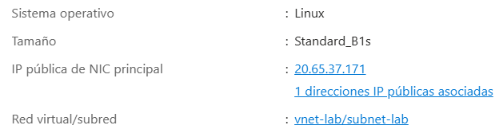
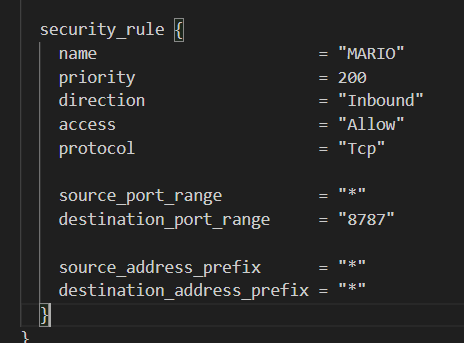
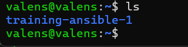
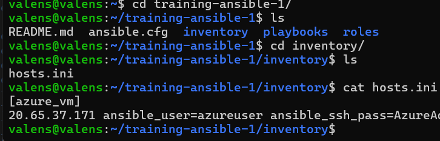
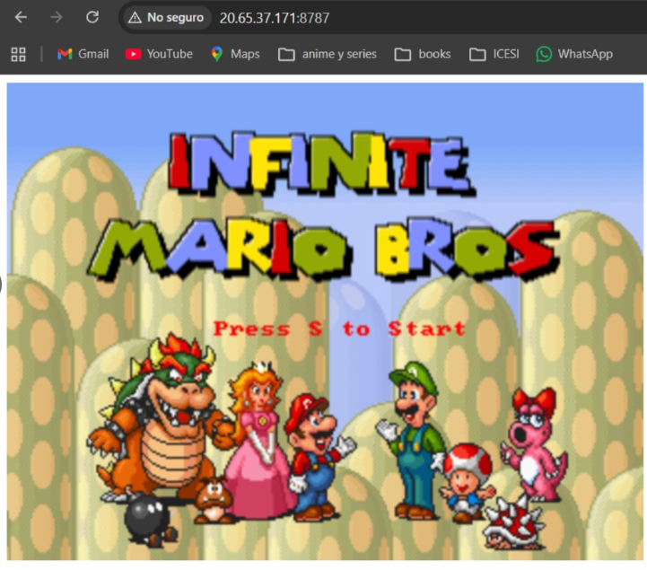

# training-ansible

**Katerine Valens Orejuela A00399512**

**Objective**

To deploy a containerized Super Mario game on an Azure virtual machine using Ansible automation. The deployment involves configuring an inbound security rule, cloning a Git repository, installing dependencies, and running Ansible playbooks to install Docker and launch the game container.

**Process**

The infrastructure had already been modularized in a previous exercise, so the virtual machine was first provisioned in Azure and then configured to run the Super Mario Bros container.

To complete the process, it was necessary to identify the public IP address of the virtual machine, confirm the access credentials, open the required network port, and then execute the Ansible playbooks responsible for installing Docker and launching the containerized application. In my case, the public IP address of the Azure virtual machine was 20.65.37.171.

Before connecting to the virtual machine, the network security group configuration had to be updated so that the application could be accessed from a browser.

Inside the main.tf file of the network module, a new security rule called MARIO was added. This rule allows inbound traffic through port 8787, which is the port mapped to the Docker container running the game.

This step was essential because, without opening the port at the network level, the application would not be reachable from outside the virtual machine.

After the infrastructure was already running in Azure, the next step was to access the local Ubuntu environment from the computer. From there, the project repository was cloned from GitHub.

Once inside the project directory, the inventory folder was opened. This folder contains the hosts.ini file, which defines the remote host that Ansible must connect to. In that file, the public IP address of the Azure virtual machine and the credentials required for remote access were added.

This inventory file is a key part of the Ansible workflow because it tells Ansible which machine must be configured and how to connect to it.

Before running the automation tasks, sshpass had to be installed. **sshpass** is a utility that allows password-based SSH authentication to be used in automated scripts and Ansible connections. It is useful when the remote server is accessed with a password instead of an SSH key, since it helps Ansible establish the SSH session without requiring manual password entry every time. Although I did not capture a screenshot of this step, the installation was necessary so that Ansible could communicate correctly with the Azure virtual machine.

After the inventory file and required tools were ready, the next step was to execute the Ansible playbooks.

The first command was:

`ansible-playbook -i inventory/hosts.ini playbooks/install_docker.yml`

This playbook was responsible for installing Docker on the Azure virtual machine. Inside the corresponding role, several tasks were executed in sequence: Installing the dependencies needed by Docker.
Adding Docker’s official GPG key. Adding the Docker repository. Installing Docker Community Edition.

These tasks prepared the virtual machine to run containerized applications.

The second command was:

`ansible-playbook -i inventory/hosts.ini playbooks/run_container.yml`

This playbook was responsible for creating and starting the container that runs the Super Mario Bros application. It used the docker_container module to pull the image pengbai/docker-supermario:latest, create the container, and expose it through port 8787.

After both playbooks were executed successfully, the Docker container was running correctly on the Azure virtual machine.

To validate the result, the application was opened in a web browser using the public IP address and port

`http://20.65.37.171:8787`

At that point, the Super Mario Bros game loaded successfully in the browser, confirming that:

- The virtual machine was reachable
- The port was correctly opened
- Docker was installed
- The container was running properly,
- The application was accessible from outside the server.

**Conclusion**

This practice allowed the automation of the deployment process for a Dockerized application on Azure using Terraform and Ansible. The modular infrastructure created in a previous exercise was reused, and the network configuration was adjusted to allow external access through port 8787.

The use of Ansible made it possible to automate both Docker installation and container execution, reducing manual work and improving repeatability. In addition, the practice reinforced the importance of having a correct inventory file, proper network rules, and a working SSH connection to the remote server.

